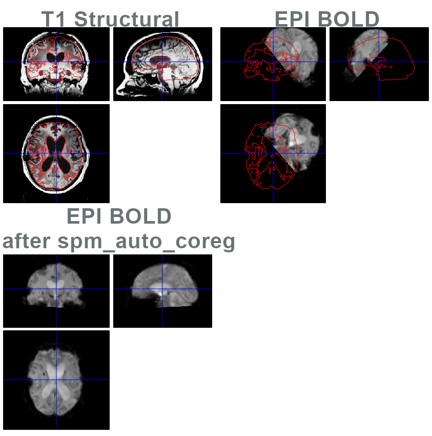

# spm_auto_reorient : Cross-platform automatic AC-PC realignment/reorientation and coregistration robust to brain damage in SPM

Cross-platform automatic AC-PC realignment/reorientation and coregistration for both healthy volunteers and brain damaged patients using template matching in SPM 12.

This is a set of routines to perform "auto reorient" and "auto coregistration" in the toolbox [Statistical Parametric Mapping 12 (SPM12)](https://www.fil.ion.ucl.ac.uk/spm/).

## Description
Setting up the AC-PC and reorienting images is a recurrent issue in between-subjects group analyses, since they rely on coregistration methods that, like the "unified segmentation" of SPM12, are for most sensitive to initial conditions (the starting orientation of the image). This routine is a somewhat enhanced version of the original code by [John Ashburner](https://en.wikibooks.org/wiki/SPM/How-to#How_to_automatically_reorient_images?).

The main function, `spm_auto_reorient.m`, automatically (but approximately) calculates a reorientation transform onto a target template in MNI space, in two steps: 1. a non-linear coregistration of the input image onto a target template in MNI space using spm_affreg is calculated, then another transform is calculated using Mutual Information on a joint histogram (spm_coreg), and then applies only the rigid-body transform part of both coregistrations to reorient the input image. This allows to mainly set the AC location and correct for head rotation and place the origin on AC, in order to further proceed with the segmentation/normalisation of the image. This relies on a "template matching" principle (as in the old normalize function), you therefore ought to specify the appropriate template/reference image (we provide some).

In any case, it is advised to check the automatically reoriented images, and [fix the orientation manually (SPM -> Display)](https://en.wikibooks.org/wiki/SPM/How-to#How_to_manually_change_the_orientation_of_an_image?) if necessary.

Another function, `spm_auto_coreg.m`, expands on the same ideas to allow coregistration between modalities (eg, between structural and functional). It is advised that `spm_auto_reorient()` to be first applied before applying `spm_auto_coreg()` (even if you do manually fix the reorientation, as this ensures that the T1 is somewhat in the MNI space, making it easier for `spm_auto_coreg()` to find the correct translation matrix).

## Install

To install this tool :
* copy `spm_auto_reorient.m` and `spm_auto_coreg.m` in your `spm` folder. This will allow the command `spm_auto_reorient()` and `spm_auto_coreg()` to be called from command-line (if no argument is given, a file selector dialog will open).
* copy `T1_template_CAT12_rm_withskull.nii` to your `spm/canonical` folder. This is a template generated on 10 subjects using CAT12 that were manually reoriented to AC-PC, this provides a better performance.

The tool can be included in the batching system of SPM12 by : 
- copying the `spm_cfg_autoreorient.m` file to the `spm/config` sub-directory. Then this module can be included in any processing pipeline;
- optionally, if you want an easy access from the SPM's spatial pull-down menu directly, by overwriting the `spm_cfg.m` with the one provided here (BEWARE: this was not updated since a long time, this may break down your SPM install!).

## Usage

Type `help spm_auto_reorient`, for all the details and various options.

## Guarantee
There is no guarantee that this will work 100% of the times, although it was observed to produce good results with our own data (young and old healthy subjects, AD/PD patients, most of brain damaged patients even with significant movement or metal artefacts).

The best results we got were by doing the following steps:
1. Call spm_auto_reorient() on the structural in MNI space, so that it is also matching other SPM templates
2. Manually review and fix the misoriented structural images
3. Coregister the functional to SPM12 EPI template (this allows a correct translation matrix and a good basis for rotation)
4. Coregister the functional onto the structural (this fine-tunes rotation to precisely match the subject's structural)

The last 2 steps can be done by calling `spm_auto_coreg()`, which has optimized default parameters for this task. For indication, on a dataset of 100 subjects with some heavily brain damaged or artifacted, the coregistration success rate was more than 95%.

For a comparison of various methods for AC-PC reorientation, the following article is a good read:

`Liu, Yuan, and Benoit M. Dawant. "Automatic detection of the anterior and posterior commissures on MRI scans using regression forests." 2014 36th Annual International Conference of the IEEE Engineering in Medicine and Biology Society. IEEE, 2014.`

## Authors
The code was originally written by Carlton Chu (FIL, UCL, London, UK) then modified and extended by Christophe Phillips (Cyclotron Research Centre, University of Liege, Belgium) and additional modifications by Stephen Karl Larroque (Coma Science Group, GIGA-Consciousness, University of Liege, Belgium).

## License
General Public License (GPL) v2

## Contact
For questions or suggestions, contact Christophe Phillips (c.phillips_at_ulg.ac.be).
